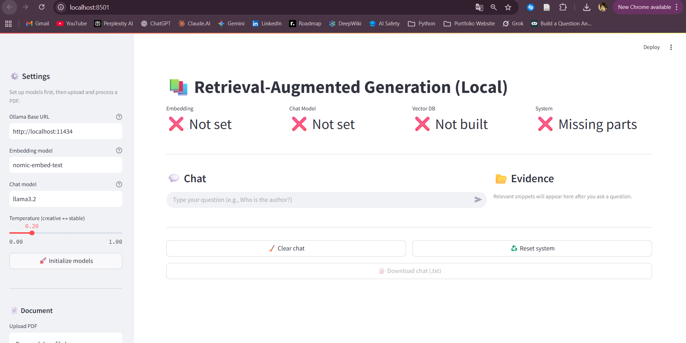

# Local RAG Demo

A lightweight, fully local Retrieval-Augmented Generation (RAG) demo that lets you upload a PDF, build embeddings with Ollama, index them in Chroma, and chat with a grounded assistant through a Streamlit UI.

---
## Features

- Local-first: Runs entirely on your machine (Ollama LLM + local vector DB).
- PDF ingestion: Split into chunks with metadata (page numbers, source).
- Semantic retrieval: Top-K relevant chunks via Chroma.
- Grounded answers: Model instructed to answer only from retrieved context.
- Evidence panel: Show the exact snippets used (file + page).
- Session state: Chat history + last retrieved docs.
- Export: One-click download of chat transcript (.txt)

## Prerequisites
- Python 3.9–3.12
- Ollama installed and running
  - macOS: ```brew install ollama```
  - Windows/Linux: see https://ollama.com

- Models pulled in Ollama:
  
```bash
ollama pull nomic-embed-text
ollama pull llama3.2
```
> Note: You can replace llama3.2 with any chat-capable model available in Ollama (e.g., mistral, qwen2.5).

## Install
Create and activate a virtual environment (recommended), then:
```bash
pip install -U langchain langchain_community langchain-ollama langchain_chroma chromadb pypdf streamlit
```
OR
```bash
pip install -r requirements.txt
```
## Run the App
1. Start the Ollama server (if it’s not auto-running):

```bash
ollama serve
```

2. Launch the Streamlit app (use your actual filename):
   ```bash
   streamlit run streamlit_app.py
    # or
    streamlit run streamlit run d:/Users/RAG/app/streamlit_app.py #Replace the file path
    ```
   
1. Open the local URL printed by Streamlit (usually http://localhost:8501).

--- 
## UI Guide

- Settings(Left Sidebar)
    - Ollama Base URL (default http://localhost:11434)
    - Embedding model (default nomic-embed-text)
    - Chat model (default llama3.2) + temperature
    - PDF upload + chunking parameters
    - Process PDF to build the vector index
    - Top-K retrieval slider

- Chat(Left main area): Conversation history and model responses.
- Evidence(Right column): Retrieved PDF snippets with file name + page.
- Clear Chat: Clears the in-memory chat history and reruns the page.
- Reset system:Re-creates the RAG system instance and clears state. You’ll need to initialize models and process a PDF again.
- Download chat: Enabled after there’s at least one message; exports the current chat transcript into .txt file and stores it in Download folder.

**UI Overview:**



## Typical Flow
1. Initialize models in the sidebar.
2. Upload a PDF, set Chunk Size / Chunk Overlap, click Process PDF.
3. Ask a question (e.g., “Who is the author?”).
4. See the answer (chat) and evidence (right panel).
5. Use Clear Chat or Reset System as needed.
6. Download Chat (.txt) when you want a transcript.

---
## Troubleshooting
- Model not found / 404
        Ensure you ```ollama pull <model>``` and the Ollama Base URL is correct.